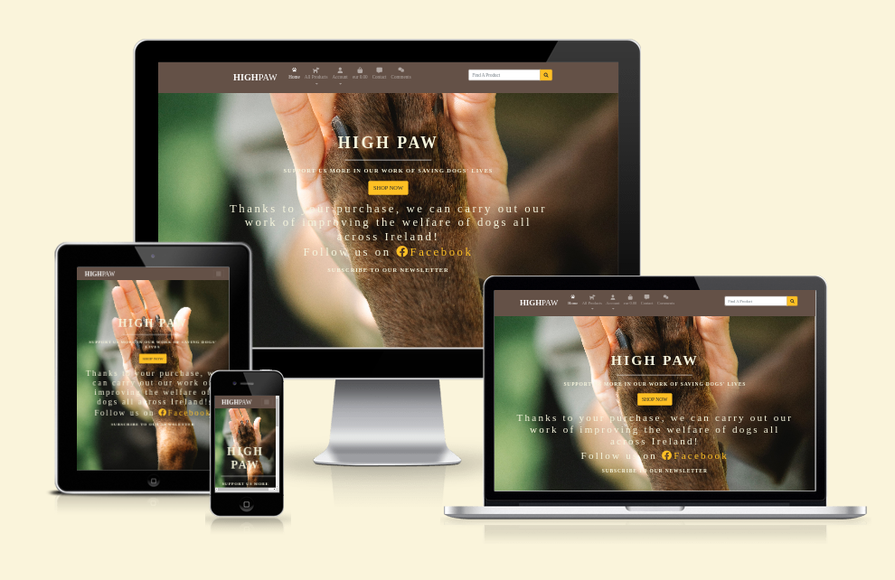
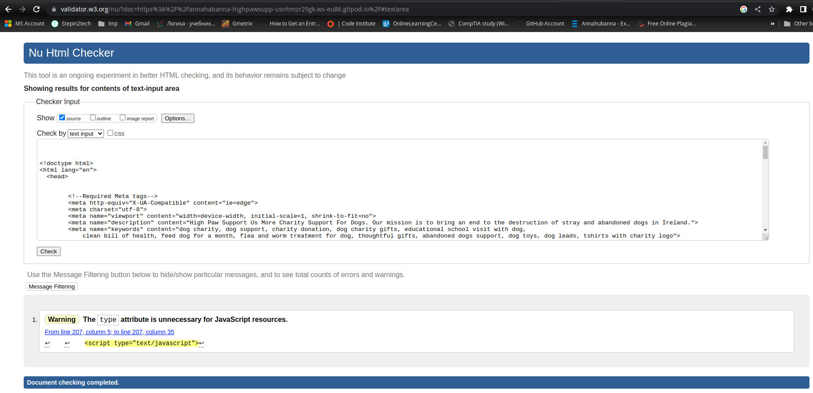
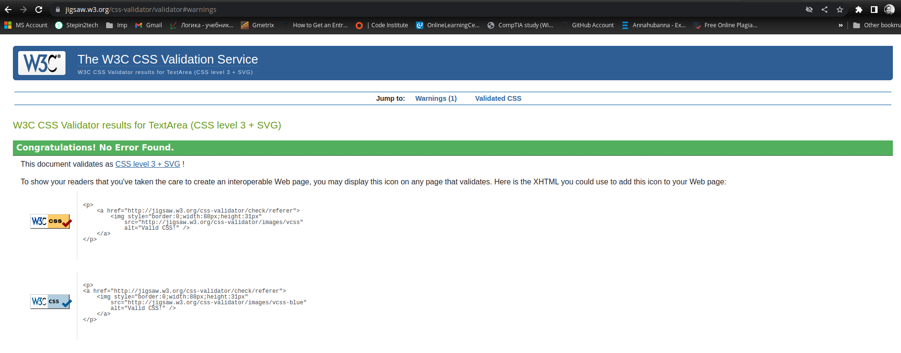
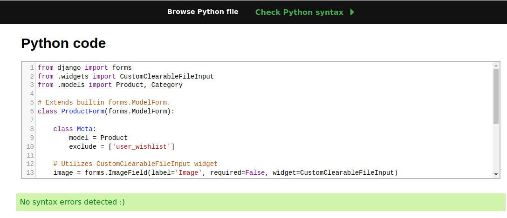
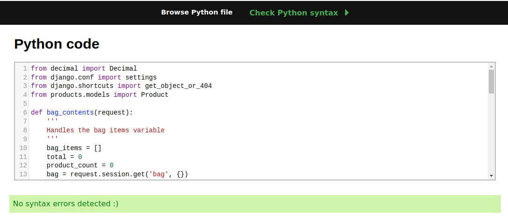
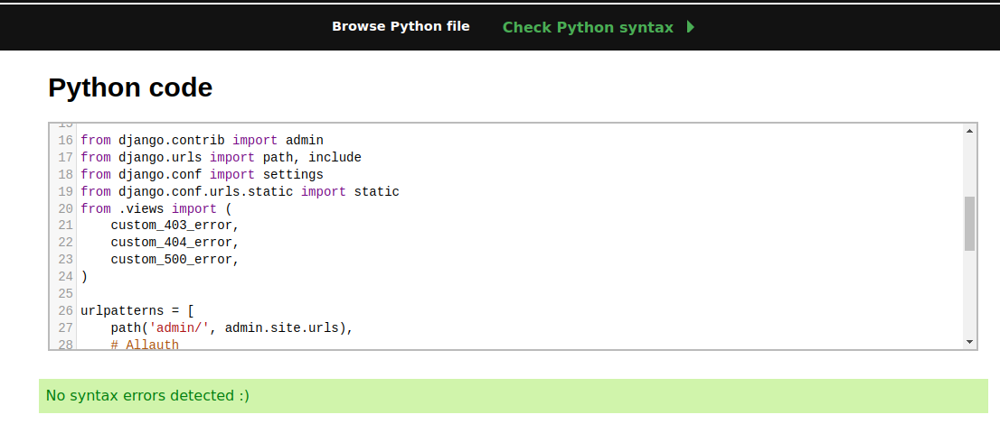
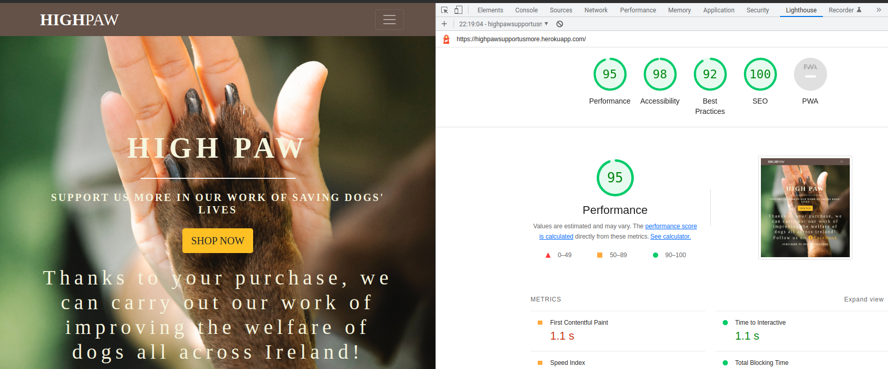

<h1 align=center>HIGH PAW</h1> 

<h2 align=center>INTRODUCTION</h2> 

HIGH PAW is a full-stack, e-commerce website built using the Django Framework with Python, Javascript, HTML and CSS.

This fictional online store provides users with various products where all proceedings go to the charity supporting abandoned dogs. 

[Visit the live site on Heroku](https://highpawsupportusmore.herokuapp.com/)

<h2 align="center"></h2>

## Table of Content
 
  * [Design](#design)
    + [Colour Sceme](#colour-scheme)
    + [Typography](#typography)
    + [Imagery](#imagery)
  
  * [User Stories](#user-stories)
    + [Site goals](#site-goals)
    + [Site User](#as-a-site-user)
    + [Superuser](#as-a-superuser)
    
  * [Website Features](#website-features)

  * [Code Validation](#code-validation)
    + [W3C HTML Validation](#w3c-html-validation)
    + [W3C CSS Validation](#w3c-css-validation)
    + [Lighthouse Validation](#lighthouse-validation)
    + [PEP8 forms.py](#pep8-formspy)
    + [PEP8 context.py](#pep8-contextspy)
    + [PEP8 urls.py](#pep8-urlspy)

  * [Manual Testing](#manual-testing)

  * [Bugs](#bugs)

  * [Deployment on Heroku](#deployment-on-heroku)

  * [Technologies Used](#technologies-used)

  * [Credits](#credits)

## Technologies Used

* Python
    * The below modules were used for the development of this project
         * asgiref==3.5.2
         * boto3==1.26.32
         * botocore==1.29.32
         * dj-database-url==0.5.0
         * Django==3.2
         * django-allauth==0.41.0
         * django-countries==7.2.1
         * django-crispy-forms==1.14.0
         * django-storages==1.13.1
         * gunicorn==20.1.0
         * jmespath==1.0.1
         * mailchimp-marketing==3.0.80
         * oauthlib==3.2.2
         * Pillow==9.3.0
         * psycopg2==2.9.5
         * python3-openid==3.2.0
         * pytz==2022.6
         * requests-oauthlib==1.3.1
         * s3transfer==0.6.0
         * sqlparse==0.4.3
         * stripe==5.0.0

* Django
     * Django was used as the main framework for the development of this full stack project.
     * Django AllAuth was used for userauthentication. 

     
    
* SQLite
* Stripe
* Heroku
* Bootstrap 4
* Favicon Generator
* Font Awesome
* Git
* GitHub
* Google Fonts
* Am I Responsive
* AWS S3 - static files hosting

### Resources

* Code Institute's Boutique Ado Walkthrough
* Django Documentation
* W3C 
* Slack Community
* StackOverflow

## User Stories 

### Site Goals

* To provide user with a space to search for rubber-ducked themed gifts and products
* To provide users with a visually pleasing website that is intuitive to use and easy to navigate
* To provide a website where the purpose is immediately clear
* To provide role-based permissions that allows users to:
    - make purchases easily
    - register for an account
    - create, read, edit and delete their profiles 
* To provide role-based permissions that allow super users to:
    - add, edit and delete products.

### As a Site User

SITE BROWSING
* I can search for a particular product using a keyword so I can find a specific product.
* I can search for products by applying filters or searching categories so that I can find a specific product.
* I can view a list of all  products so I can overview all availabel stock.
* I can view a product so that I can see more detailed information about the product.
* I can navigate easily around the site to find what I am looking for.

USER REGISTRATION
* I can register for an account using my username, email and password so that I can use my account profile.
* I can log in and out of my account easily so that I can access my account.
* I can access my account so that I can view details of my previous orders.
* I can reset my password so that I can have secure account access.
* I can add and remove items to my wishlist so that I can review my favourite products.

CHECKOUT
* I can add products to my shopping bag so that I can checkout later.
* I can modify the items in my shopping bag so that I can change my mind.
* I can pay for the items in my shopping bag so that I can easily make a purchase.

ADDITIONAL
* I can subscribe to a newsletter so that I can be informed of new products, special offers and discount codes.
* I can contact the site owner if I wish to know more about a product, the service provided or my order.

### As a Superuser

* I can view each product so I can review the details and price.
* I can add products so that the website can display new products.
* I can delete products from the website so that the store inventory is controlled.
* I can update product details so that the information is updated.

## Website Features

* Simple design easy to navigate
* Intuitive navigation
* Role-based navigation
* Searching bar
* Sorting and Filtering
* User Login/Logout
* Secure payment
* Contact Page
* Custom 404 & 500 error pages
* User Wishlist 

## Code Validation

#### W3C HTML Validation

#### W3C CSS Validation

#### PEP8 forms.py

#### PEP8 contexts.py

#### PEP8 urls.py

#### Lighthouse Validation

## Deployment on Heroku

1. Log in to Heroku

2. From Heroku Dashboard select 'New' and then 'Create New App'

3. Give the project a name and select a suitable region, then select create app. The name for the app must be unique. This will create the app within Heroku and bring you to the deploy tab. From the submenu at the top, navigate to the resources tab.

4. Add the database to the app, in the add-ons section search for 'Heroku Postgres', select the package that appears and add 'Heroku Postgres' as the database

5. Navigate to the setting tab, within the config vars section copy the DATABASE_URL to the clipboard for use in the Django configuration.

6. Within the django app repository create a new file called env.py - within this file import the os library and set the environment variable for the DATABASE_URL pasting in the address copied from Heroku. The line should appear as os.environ["DATABASE_URL"]= "Paste the link in here"

7. Add a secret key to the app using os.environ["SECRET_KEY"] = "your secret key goes here"
Add the secret key just created to the Heroku Config Vars as SECRET_KEY for the KEY value and the secret key value you created as the VALUE

8. In the settings.py file within the django app, import Path from pathlib, import os and import dj_database_url
insert the line if os.path.isfile("env.py"): import env
remove the insecure secret key that django has in the settings file by default and replace it with SECRET_KEY = os.environ.get('SECRET_KEY')
replace the databases section with DATABASES = { 'default': dj_database_url.parse(os.environ.get("DATABASE_URL"))} ensure the correct indentation for python is used.

9. In the terminal migrate the models over to the new database connection

10. Navigate in a browser to Amazon AWS, log in, or create an account

11. Create a new S3 bucket for the site and create a static directory and media directory within the bucket
12. From the dashboard - copy the bucket details into the settings.py file:
- you will require the following:
- Storage Bucket Name
- Storage Bucket Region Name
- Access Key ID
- Secret Access Key

13.  Add these settings to the env.py file to link AWS:
- os.environ["AWS_ACCESS_KEY_ID"] = 'your access key'
- os.environ["AWS_SECRET_ACCESS_KEY"] = 'your secret access key'

14. Back in Heroku, add the keys and values from AWS and env.py to the config vars

10. In the Settings.py file - add the STATIC files settings - the url, storage path, directory path, root path, media url and default file storage path.
Link the file to the templates directory in Heroku TEMPLATES_DIR = os.path.join(BASE_DIR, 'templates')

14. Change the templates directory to TEMPLATES_DIR - 'DIRS': [TEMPLATES_DIR]

15. Add Heroku to the ALLOWED_HOSTS list the format will be the app name given in Heroku when creating the app followed by .herokuapp.com

16. In your code editor, create three new top level folders, media, static, templates

17. Create a new file on the top level directory - Procfile

18. Within the Procfile add the code - web: gunicorn PROJECT_NAME.wsgi

19. In the terminal, add the changed files, commit and push to GitHub

20. In Heroku, navigate to the deployment tab and deploy the branch manually - watch the build logs for any errors.

Heroku will now build the app for you. Once it has completed the build process you will see a 'Your App Was Successfully Deployed' message and a link to the app to visit the live site.

### Forking the Github Repository

1. By forking the GitHub Repository, you will be able to make a copy of the original repository on your own GitHub account, allowing you to view and/or make changes without affecting the original repository by using the following steps:

2. Log in to GitHub and locate the GitHub Repository At the top of the Repository (not top of page), just above the "Settings" button on the menu, locate the "Fork" button. You should now have a copy of the original repository in your GitHub account.

### Making a Local Clone

1. Log in to GitHub and locate the GitHub Repository Under the repository name.

2. Click "Clone or download". 

3. To clone the repository using HTTPS, under "Clone with HTTPS", copy the link. 

4. Open Git Bash.  

5. Change the current working directory to the location where you want the cloned directory to be made. 

6. Type git clone, and then paste the URL you copied in Step 3.

### Stripe payment setup

This project uses Stripe as a payment provider -
1. Create a stripe account at stripe.com
2. Choose developer account to gain access to the api keys required to run the payment processes
3. Once you have successfully created your stripe account:
- Copy the stripe public key, stripe secret key and stripe webhook key into your env.py file and into heroku config vars
- Configure the settings file to find the variables required by stripe.

For more information on how to set up stripe with Django, please refer to the [Stripe Documentation](www.stripe.com).

## Credits

* I took a lot of inspiration from the [Code Institute's](https://codeinstitute.net/) Boutique Ado walkthrough and relied on its the models, views and templates.
